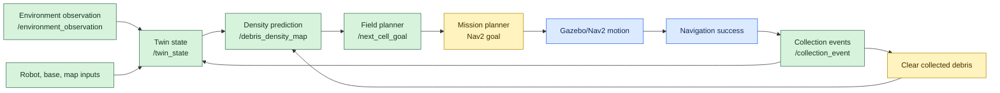

# CORAL-G Full Integration Plan

Baseline: `c9c95a9` on `debris-minimal-sim`.
Planning branch: `full-integration-planning`.

This plan starts from the current debris minimal simulation loop. It does not
restart from the older integration proof of concept because that branch diverges
from, and deletes, most of the newer debris prediction, dashboard, mission
contract, documentation, and tests.

## Current Baseline

The current baseline already has the digital-side mission spine:

```text
/environment_observation
+ /collection_event
+ /robot_state
+ /base_pose
+ /map
-> /twin_state
-> /debris_density_map
-> /next_cell_goal
-> mission_planner_node Nav2 NavigateToPose contract
```

Implemented in `src/my_tb3_world`:

- `base_reference_node`: publishes `/base_pose`.
- `robot_state_node`: reads `/odom` and `/collection_event`, publishes
  `/robot_state` with pose, fuel, storage, and base status.
- `environment_generator_node`: provides the map-aware environment field
  service.
- `environment_node`: owns physical debris truth for the sim, publishes
  `/environment_observation`, `/collection_event`, and debug-only `/dashboard`.
- `digital_twin_state_node`: fuses robot, base, map, environment, material
  evidence, and collection history into `/twin_state`.
- `debris_prediction_node`: owns `/debris_density_map`.
- `field_planner_node`: reads `/twin_state` and `/debris_density_map`, publishes
  `/next_cell_goal`.
- `mission_planner_node`: validates `/next_cell_goal` and converts accepted
  intents into Nav2 `NavigateToPose.Goal`.
- `tools/debris_dashboard_web.py`: debug dashboard, including planner intent
  visualization from `/next_cell_goal`.

Verified baseline behavior from the handoff:

- Digital-side integration test can drive fake inputs through twin,
  prediction, and field planner to produce `/next_cell_goal` without Gazebo,
  Nav2, or dashboard inputs.
- Dashboard preview shows the planner target and dynamic current field.
- Docker build and direct node tests passed.
- `colcon test --packages-select my_tb3_world` still has known repo-wide
  flake8/pep257 lint failures.

Known baseline mismatch:

- Normalized `/debris_density_map` densities can sit below
  `field_planner_node.min_density_reward=0.1`, causing idle even when debris is
  active. Preview verification used `min_density_reward:=0.001` only for the
  live dashboard target.

## Older Integration PoC Branch

Remote branch inspected: `origin/coral-g-digital-twin-poc`.

Commits unique to that branch:

- `e209fae` Add CORAL-G digital twin PoC
- `35c3127` Add simulation runbook
- `c22edb0` Lock mission goals during navigation
- `97bda19` Add reset guide and automatic initial pose
- `4f70f81` Add combined run and reset PDF guide
- `9bd76ff` Remove separate run and reset guides
- `1724b0d` Configure three-cell mission flow
- `5322a09` Clean up local generated guides

That branch adds:

- `src/coral_g`: a separate ROS 2 package with compact pure-Python contracts,
  core logic, and ROS node wrappers.
- `src/coral_g_interfaces`: a `ResetReseed` service.
- `/coral_g/...` namespaced JSON topics.
- `CORAL_G_NODES.md` and `README.md` documentation.
- Tests for the separate `coral_g` package.
- A finite three-target mission flow.
- A collection report node that emits logical collection reports when navigation
  succeeds.
- Nav2 goal locking/status behavior and an initial pose publisher.
- A demo report/control-surface boundary.

That branch also removes or replaces important newer baseline work:

- Deletes the current debris docs and handoff/ledger.
- Deletes the current `my_tb3_world` debris nodes:
  `environment_node`, `environment_field`, `digital_twin_state_node`,
  `debris_prediction_node`, `field_planner_node`, `mission_planner_node`,
  `robot_state_node`, `base_reference_node`, and launch files.
- Deletes the current dashboard tools.
- Deletes most of the expanded `my_tb3_world` tests.
- Reverts Nav2 launch toward default TurtleBot params rather than the custom
  project params from the baseline.

Conclusion: treat `origin/coral-g-digital-twin-poc` as a source of integration
ideas, not as a branch to merge wholesale.

## Reusable Pieces From The PoC

Backport candidates:

- Finite mission target behavior, especially if the full demo needs a clear
  three-cleanup-cell narrative.
- Success-driven `collection_report_node` behavior, adapted to the baseline
  `/collection_event` contract instead of the PoC `/coral_g/collection_report`
  schema.
- Goal locking while Nav2 is active, but adapted to the existing
  `mission_planner_node` boundary.
- Initial pose publisher or launch-time initial pose support for repeatable
  Gazebo/Nav2 demos.
- `ResetReseed` service boundary if manual reseeding is still needed outside
  the debug dashboard reset topic.
- Contract smoke-check idea, adapted to the baseline `dtas.*` schemas and the
  existing unit suite.
- Runbook material from `CORAL_G_NODES.md`, rewritten around the current
  baseline topics.

Do not backport as-is:

- The `/coral_g/...` topic namespace unless there is a deliberate project-wide
  namespace migration.
- The PoC `coral_g.twin_state.v1`, `coral_g.debris_density_map.v1`, or
  `coral_g.next_cell_goal.v1` schemas.
- The PoC `digital_twin_state` fusion model, because the current
  `digital_twin_state_node` already has stronger map/robot/base/environment
  contract coverage.
- The PoC branch's deletions of dashboard, docs, custom Nav2 params, and tests.

## Integration Direction

Keep the current baseline as the canonical system and integrate forward in
small packets:

1. Parameter and launch cleanup.
   - Surface field/current/debris/planner tuning from launch or YAML.
   - Resolve the `min_density_reward` mismatch intentionally.
   - Keep dashboard overrides explicit and separate from mission defaults.

2. Mission lifecycle closure.
   - Add a success-driven collection/lifecycle bridge for real Nav2 runs.
   - Ensure successful cleanup goals generate baseline-compatible
     `/collection_event` messages.
   - Ensure return-to-base success resets storage/fuel through existing
     contracts.

3. Nav2 active-goal protection.
   - Prevent planner churn from canceling/replacing active Nav2 goals.
   - Preserve duplicate suppression already in `field_planner_node`.
   - Keep Nav2 status internal to `mission_planner_node` unless a debug topic is
     explicitly needed.

4. Repeatable full-demo launch.
   - Compose Gazebo, SLAM/Nav2, CORAL-G nodes, initial pose, and dashboard.
   - Keep the current no-live-Nav2 digital integration test as the fast gate.
   - Add a manual full-demo runbook after the launch is stable.

5. Contract smoke check.
   - Add a lightweight command that validates sample baseline `dtas.*` JSON
     contracts.
   - Do not replace the existing unit tests; use it as a quick operator check.

## Full Mission Loop Target

The ideal integration target is the complete mission loop:

```text
physical/logical debris appears
-> /environment_observation + /collection_event inputs
-> /twin_state
-> /debris_density_map
-> /next_cell_goal
-> mission_planner_node sends Nav2 NavigateToPose goal
-> navigation succeeds
-> baseline-compatible /collection_event is emitted
-> prediction clears collected debris
-> planner selects the next target
-> repeat until return-to-base or idle mission-complete
```

This is not out of reach because the digital side is already contract-tested.
The missing integration work is mainly the navigation lifecycle closure: Nav2
result state needs to flow back into collection/prediction without weakening the
existing mission contracts.

Use the older `origin/coral-g-digital-twin-poc` branch only as reference for:

- goal locking/status while Nav2 is active;
- success-driven collection reporting;
- repeatable initial pose setup;
- finite mission target/demo narrative;
- operator runbook language.

Do not adopt its separate `/coral_g/...` topic model unless the project chooses
a deliberate namespace migration later.

## Visual Integration Status

Add an integration-status view before or alongside the chunk ledger so the plan
is visible to reviewers.

Preferred presentation:

- For docs: a Mermaid graph with stages marked as `complete`,
  `local-testable`, `partner-testable`, or `lab-only`.
- For dashboard: a hover-only status legend/overlay rather than another strong
  map color. The debris, density, current, and planner colors already carry
  meaning; integration status should explain readiness without competing with
  mission data.

Suggested stage labels:

- `complete`: contract-tested and already in the baseline.
- `local-testable`: can be validated on this machine with unit tests, mocked
  ROS/Nav2, Docker, or dashboard preview.
- `partner-testable`: needs Gazebo/RViz/Nav2 on the lab partner's environment,
  but should be prepared from this repo with clear commands and expected
  observations.
- `lab-only`: depends on final in-lab Linux/classroom setup, robot/environment
  timing, or hardware-specific constraints.



Legend: green is already complete in the baseline; yellow is local-testable;
blue is partner Gazebo/RViz-testable; gray remains lab-only if it depends on
the final lab Linux setup.

## Verification Boundaries

Max out local verification first, then hand a ready package to the partner
Gazebo/RViz environment, then reserve only the remaining environment-sensitive
checks for the lab Linux session.

### Boundary 1: Local Project Verification

Goal: prove the full lifecycle logic without requiring live Gazebo/Nav2.

Expected local checks:

- Python compile and focused unit suite.
- Mocked Nav2 action tests for `mission_planner_node`.
- Fake-input ROS-side test through `/twin_state`, `/debris_density_map`, and
  `/next_cell_goal`.
- Mock navigation-success test proving a cleanup success emits a
  baseline-compatible `/collection_event`.
- Collection-clearance test proving the prediction/planner moves past a
  collected target.
- Dashboard/browser verification for planner intent and integration status.
- Docker build and direct node test suite when useful.

Local acceptance:

- The mission lifecycle is complete with mocked Nav2.
- No mission node consumes dashboard/debug topics.
- Planner threshold behavior is deterministic and documented.
- The repo contains the launch/runbook material needed for the next boundary.

### Boundary 2: Optional Local Gazebo/Nav2 Verification

Goal: run Gazebo/Nav2 locally if this machine can support it, without making it
a hard gate.

This may be possible only if the local environment has working ROS 2, Gazebo,
RViz/Nav2 dependencies, display support, and adequate performance. If those are
missing, do not treat it as a product failure; move to the partner boundary.

Optional local Gazebo acceptance:

- Gazebo world launches.
- SLAM/Nav2 or localization stack reaches active state.
- `mission_planner_node` accepts `/next_cell_goal` and sends a Nav2 goal.
- TurtleBot starts moving toward at least one selected cleanup target.
- Any failure is captured as an environment/runbook note, not hidden.

### Boundary 3: Partner Gazebo/RViz Pre-Lab Verification

Goal: make the local project ready for a lab partner to run in their Gazebo/RViz
environment before the final lab session.

Partner-ready acceptance:

- A single documented command sequence exists for build, source, launch, and
  reset.
- Expected topics and sanity checks are listed.
- Partner can confirm Gazebo world, RViz/Nav2, CORAL-G nodes, dashboard, and
  planner target visibility.
- Partner can confirm at least one Nav2 cleanup goal is issued from a real
  `/next_cell_goal`.
- If robot motion fails, logs identify whether the issue is Nav2 activation,
  map/pose alignment, planner/controller behavior, or CORAL-G contract flow.

Stretch partner acceptance:

- TurtleBot reaches one cleanup target.
- A collection event is produced after success.
- Prediction clears the collected target and planner chooses the next target.

### Boundary 4: Final Lab Linux Verification

Goal: validate the complete demo in the actual lab environment.

Lab acceptance:

- Full launch starts Gazebo, SLAM/Nav2 or localization, CORAL-G nodes, and
  dashboard.
- TurtleBot reaches at least one selected cleanup target.
- Cleanup success feeds back into `/collection_event`.
- Prediction clears collected debris and the planner either selects the next
  target, returns to base, or idles mission-complete according to state.

Lab stretch acceptance:

- Complete all configured targets.
- Return to base or finish with a clean idle state.
- Demonstrate recovery or clear operator guidance for local planner failures.

Lab-only risk areas:

- Real robot/Gazebo motion to selected targets.
- Nav2 recovery behavior after local planner failures.
- SLAM/map alignment and initial pose reliability.
- Real-time timing across Gazebo, SLAM, Nav2, and CORAL-G nodes.
- Classroom machine, OS, display, and dependency differences.

## Next Packet Recommendation

Start with parameter and launch cleanup plus lifecycle acceptance design. This
keeps the next implementation packet small while setting up the full-loop work
for local, partner, and lab verification.

Acceptance criteria:

- Planner threshold behavior is documented and test-covered.
- A launch/YAML path can choose demo-tuned planner thresholds without editing
  code.
- The acceptance boundary for local, partner, and lab verification is explicit.
- Existing digital-side integration tests continue to pass.
- Dashboard preview still uses debug-only inputs and does not become mission
  input.
